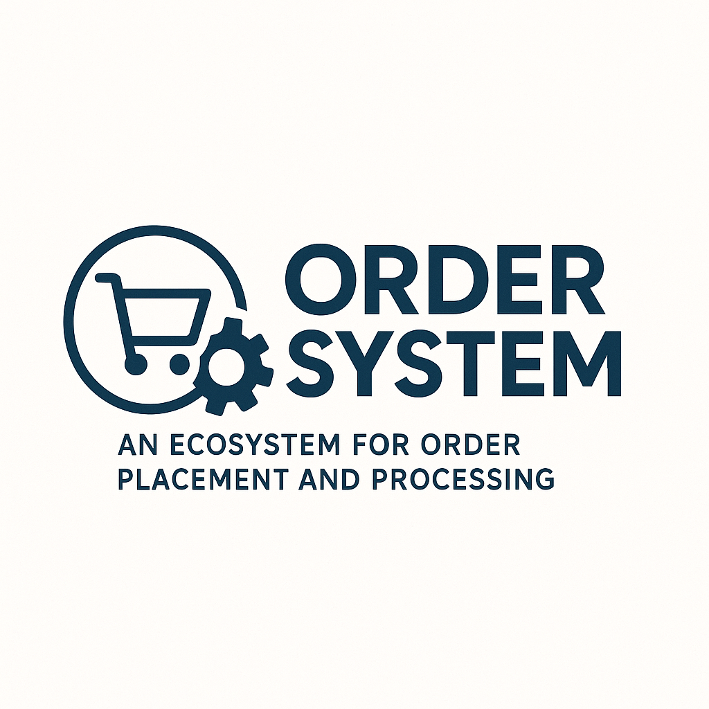

<div align="center">

<!---->

<h1>Order System</h1>
<p>
    An Ecosystem for Order Placement and Processing.
</p>

</div>

# :clipboard: Table of Contents

- [About the Project](#star-about-the-project)
    * [Technologies](#microscope-technologies)
    * [Tools](#wrench-tools)
- [Getting Started](#beginner-getting-started)
    * [Configuration](#configuration)
    * [Example Environment Variables](#example-environment-variables)
- [Docker Usage](#whale-docker-usage)
    * [Running the Application](#running-the-application)
- [Contact](#handshake-contact)

## :star: About the project
This project is an educational initiative focused on building a microservices-based ecosystem for handling order workflows.

The core idea is to simulate a real-world scenario where an order is received through an API, published to a message broker (Kafka), consumed by independent services, persisted in a document-oriented database, and followed by a customer notification via email.

Rather than solving a complex business problem, the goal is to explore architectural patterns, integration strategies, containerization, and messaging in distributed systems using modern tools and best practices.

### :microscope: Technologies
- [Kotlin](https://kotlinlang.org/)
- [Spring Boot](https://spring.io/projects/spring-boot)
- [Gradle](https://gradle.org/)
- [Swagger](https://swagger.io/)
- [Apache Kafka](https://kafka.apache.org/)
- [RavenDB](https://ravendb.net/)
- [Docker](https://www.docker.com/)
- [Eureka](https://spring.io/projects/spring-cloud-netflix/)
### :wrench: Tools
- [IntelliJ IDEA](https://www.jetbrains.com/idea/)
- [Apidog](https://apidog.com/)

## :beginner: Getting Started

### Configuration

Each service has an `application.yaml` file for configuration. Environment variables can be used to customize the default values.

### Example Environment Variables

```env
SPRING_PROFILES_ACTIVE=profile

EUREKA_CLIENT_URL=eureka-url

KAFKA_GROUP_ID=group-id
KAFKA_ORDERS_TOPIC=orders-topic
KAFKA_SERVER=kafka-server
KAFKA_TOPIC=orders-topic

NOTIFICATOR_URL=notificator-url

MAIL_HOST=host
MAIL_PORT=port
MAIL_USERNAME=username
MAIL_PASSWORD=password

RAVENDB_DATABASE=database
RAVENDB_URL=raven-url
```

## :whale: Docker usage
### Running the application
```bash
cd docker
docker compose up -d
```

## :handshake: Contact
LinkedIn: [Gusthawo Junkes](https://www.linkedin.com/in/gusthawojunkes/)
<br />
E-mail: [gusthawojunkes14@gmail.com](gusthawojunkes14@gmail.com)